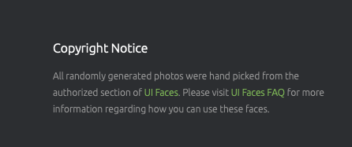

# A Random User Generator App using [React js](https://reactjs.org) , React-Router and React-Hooks

# A free, open-source API for generating random user data. Like Lorem Ipsum, but for people

# vist to their official docs `https://randomuser.me`

## Features this app have

### **generating random user data from**

- **Nationalities**
- **Gender**

### setting up the project

`git clone `

`cd contacts-manager`

In the project directory, you can run:

#### `npm start`

Runs the app in the development mode.\
Open [http://localhost:3000](http://localhost:3000) to view it in the browser.

The page will reload if you make edits.\
